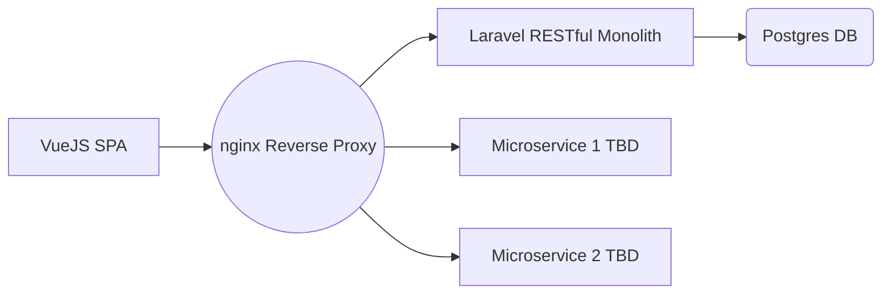

# Welcome to this marvellous test project!

I've made this project for testing purposes, clean up the rust and improve in all the stacks.

### Frontend
The frontend is a simple VueJS3 SPA + TailwindCSS, with Pinia as the state management library and Vite as the local development server.

### Backend

The backend is built with Laravel, that serves a pool of _RESTful Apis_, with simple CRUD, some public API integrations, several calls to AWS Lambdas and so on.
It already contains basic exceptions handler and a global json encoded response with a middleware, so that you don't have to specify everytime the format.

### Database
For the database i choose postgres, despite the repository description, to actually try something different from MySql, and actually trying to understand why is postgres conquering the market so fastly (lol). Database seeding is managed through DBMate. 

### Local Development (Docker + Docker compose)
I've managed to create a local development context with docker and docker compose.
Following, a scheme on how its structured so far:

